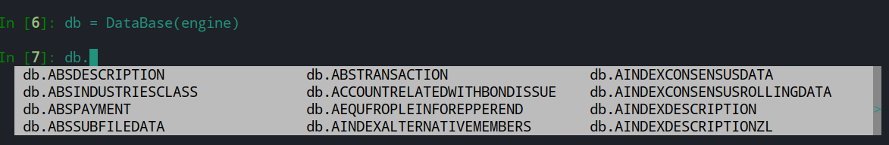
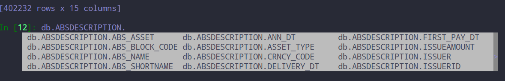

# sangreal-db
基于sqlalchemy的python数据库orm包，加入对交互式编程的支持，更简易的API。

## 安装

```pip install sangreal-db```

## 使用方法

### 建表

```python
from sangreal_db import DataBase
from sqlalchemy import create_engine

engine = create_engine('mysql://....')
# or
engine = 'mysql://....'

# 实例化
db = DataBase(engine, schema=None)

from sqlalchemy import Column, Integer, String

# 构建User类
class User(db.Base):
    __tablename__ = 'users'
    id = Column(Integer, primary_key=True)
    name = Column(String(20))
    fullname = Column(String(20))
    password = Column(String(20))

    def __repr__(self):
        return "<User(name='%s', fullname='%s', password='%s')>" % (
            self.name, self.fullname, self.password)

# 建表
db.create_all()
```

### 查

更多api用法可参考[python对Mysql操作和使用ORM框架（SQLAlchemy）](https://www.cnblogs.com/pycode/p/mysql-orm.html)

```python

# database下以TABLE_NAME为表名的Table类
# TABLE_NAME为任意该database下存在主键的表
table = db.TABLE_NAME

# 表TABLE_NAME下以COLUMN为列名的Column类
table.COLUMN

# 继承了sqlalchemy的Query，支持同样方法
# 返回实例化对象序列
db.query(table).filter(table.COLUMN==....).all() 

# 返回DataFrame
db.query(table).filter(...).to_df()

```

### 增/改 (适用于逐条增改)

```python
# 增
t_obj_add = table(c1=xxx, c2=xxx, c3=xxx)
db.update(t_obj_add)
db.commit()

# 改
t_obj_update = db.query(table).filter(...).all()
for t in t_obj_update:
    t.c1 = xxx
db.update(t_obj_update)
db.commit()

# 或者一起搞
# 构建一个iterable对象
t_change = [t_obj_add] + t_obj_update
db.update(t_change)
db.commit()

# 或者另外一种模式
db.query(table).filter(...).update({table.c1: "hello"}, synchronize_session=False)
db.commit()
```

### 批量插入

```python
import pandas as pd
df = pd.DataFrame(...)
# 批量插入支持DataFrame格式 或 list of dicts [{'xx': ...}, ..., {}]
# ignore默认为True，如果存在唯一性索引，会忽略重复键错误
# 解决了pandas中 if_exist='append'中重复插入报错的问题
db.insert(table, df, ignore=True)
db.commit()
```

### 删

```python
# 删
t_obj_delete = db.query(table).filter(...).first()
db.delete(t_obj_delete)
db.commit()

# 或者另外一种模式
db.query(table).filter(...).delete()
db.commit()
```

___

### ipython or jupyter-notebook

实例化Database类后，sangreal-db会自动为该实例添加以表名命名的属性，这点在交互式编程中十分方便。

**需要注意的是**，该属性为懒加载，并不会一次性将database下的所有表映射成Table类，只有在单独调用时才会映射对应的表，解决了性能问题。





